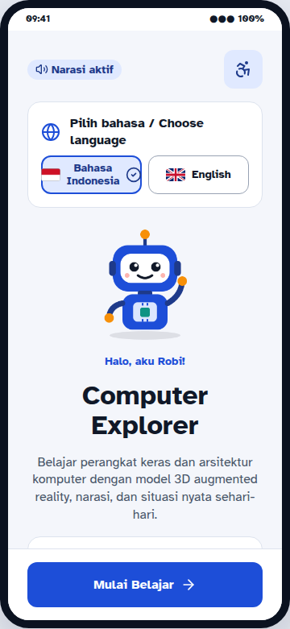
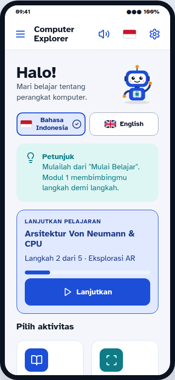
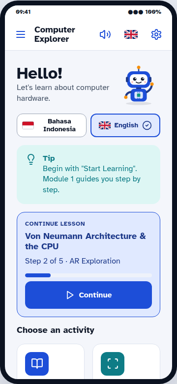
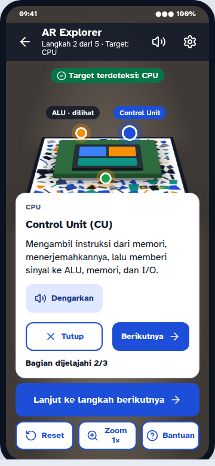
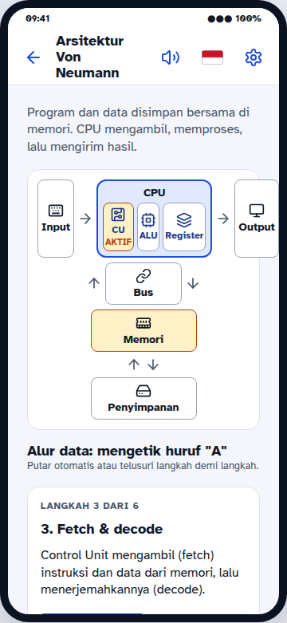
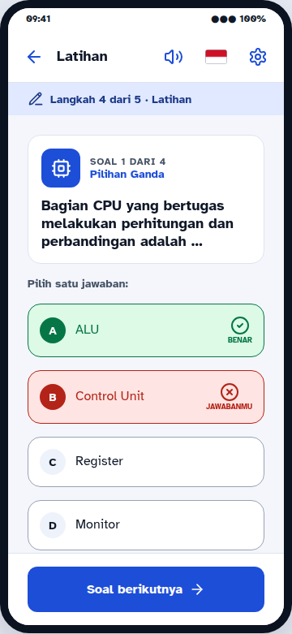
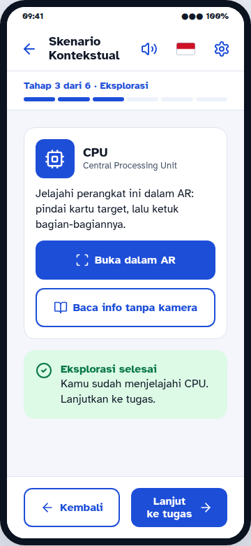
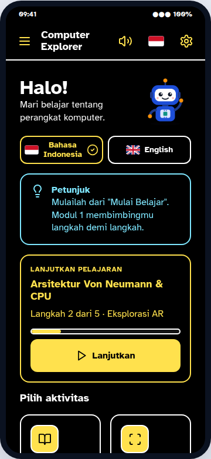
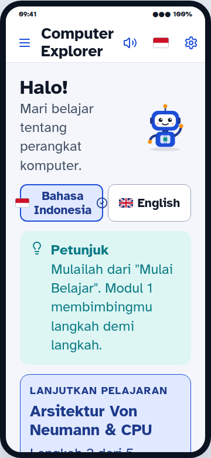

# Computer Explorer AR

**An inclusive, contextual augmented-reality app for learning computer hardware and computer architecture.**
Built with Unity and Vuforia Engine. It follows the *Inclusive & Contextual AR Learning Application — Developer Blueprint*.

**Bilingual: Bahasa Indonesia and English.** Tap a flag to switch the whole app, including every lesson,
question and the narration voice.

Students scan printed cards to explore 3D models of the CPU, RAM, storage, input/output devices and the Von Neumann
architecture. They listen to narration, work through real-life scenarios, answer practice
questions, write reflections and follow their progress. Accessibility settings are global, persistent and testable
on every screen.

<p align="center">
  
  
  
  
  
</p>
<p align="center">
  
  
  
  
</p>

> The full design system (tokens, type scale, component states and all screens at 360 × 780 dp) is in
> **[`Docs/design/index.html`](Docs/design/index.html)**. Open it in a browser.

---

## Features

| Area | What is implemented |
|---|---|
| **Two languages** | Bahasa Indonesia and English. Choose a language with the flag buttons on the Welcome screen, the Main Menu, the ☰ menu or Settings, or with the flag icon in every screen's header. All UI text, all learning content (modules, hardware, hotspots, scenarios, questions, feedback), the Teacher Guide and the narration voice (TTS `id-ID` / `en-US`) switch instantly. The choice is saved. Answers are stored by position, so switching mid-question never changes a result. |
| **Navigation** | All 15 scenes from the blueprint. The flow is Splash → Welcome → Main Menu → Modules → Module Detail → guided lesson steps. Back history and the Android back button are supported. |
| **Vertical slice (§17)** | Module 1: Von Neumann diagram → AR scan of the CPU → hotspots (ALU, Control Unit, registers) → narration → contextual scenario → practice → feedback → reflection → progress. |
| **AR (§7)** | Vuforia Image Targets created at runtime from PNGs, so no Target Manager upload is needed. Nine targets. Procedural 3D models with tappable hotspots and an animated Von Neumann data flow. Rotate and zoom controls. Tracking states: searching, detected, lost and error, with recovery help. |
| **Simulation Mode** | The AR scanner also runs without a camera or Vuforia: a virtual card on a desk. Use it in the Editor, on devices without AR support, or when the camera is refused. |
| **Content (§8)** | `HardwareData`, `ModuleData`, `QuestionData` and `ScenarioData` ScriptableObjects: 4 modules, 9 hardware items, 5 scenarios and 17 questions. Every text field has an English twin (`…En`). |
| **Practice (§12)** | Multiple choice, true/false, matching, identification (typed answer), ordering, contextual scenario and AR identification. Every question has an explanation. |
| **Accessibility (§9)** | 4 text sizes with reflowing layouts, a High Contrast palette, narration on/off with volume, auto-read, reduced motion, guided/standard mode and large touch targets. State is never shown by colour alone. |
| **Audio (§10)** | Narration play/pause/replay from recorded clips (separate Indonesian/English clip fields), with Android Text-to-Speech (`id-ID` or `en-US`) as fallback. Background music ducks while speech plays. UI and feedback sounds are synthesised. |
| **Progress (§13)** | Local JSON save (atomic writes) for modules, lesson steps, AR activities, hotspots, scenarios, quiz results, reflections and last accessed module. |
| **Teacher Guide** | Objectives, a 2 × 40 min lesson plan, preparation, target usage, observation points, inclusive-support tips, the UDL/CTL/Mayer/ADDIE mapping, and an "unlock all modules" switch. |

## Quick start

1. **Install Unity 6 LTS** (6000.0.x) with **Android Build Support** (OpenJDK, SDK and NDK).
2. In Unity Hub choose **Add → Add project from disk** and select this folder. If your editor version differs, pick
   your installed 6000.0.x.
3. When the project opens, run the menu **Computer Explorer → Setup Project**. It:
   - creates the 15 scenes in `Assets/Scenes` and adds them to Build Settings in order,
   - writes the content ScriptableObjects to `Assets/ScriptableObjects` and the index `Assets/Resources/ContentDatabase.asset`,
   - applies the Android player settings: portrait, IL2CPP, ARM64, API level 26 or higher, app icon, bundle id `com.computerexplorer.arlearning`.
4. Open `Assets/Scenes/00_Boot.unity` and press **Play**. Without Vuforia, the AR scanner runs in Simulation Mode.

### Adding Vuforia (real camera AR)

1. Create a free account at developer.vuforia.com and generate a **Basic license key** (License Manager).
2. Download the **Vuforia Engine** Unity package (`add-vuforia-package-x.y.z.unitypackage`) and import it
   (*Assets → Import Package → Custom Package*). This adds `com.ptc.vuforia.engine` to the project.
3. `VUFORIA_ENGINE` is defined automatically (menu *Computer Explorer → Refresh Vuforia Define* if needed).
4. Run **Computer Explorer → Setup Project** again. The AR scene then gets a camera with `VuforiaBehaviour`.
5. *Window → Vuforia Configuration* → paste your **App License Key**.
6. Print `Docs/ar-targets/print-targets.html` at **100 % scale**. Each target is 15 cm wide.

Targets are created at runtime from `Assets/Resources/ARTargets/*.png`
(`ObserverFactory.CreateImageTarget(texture, 0.15, name)`). To use a Target Manager device database instead,
tick **Use Device Database** on the `ARSessionController` in `05_ARScanner` and import the database.

> Check versions against the official Vuforia documentation before the final build (blueprint §24). The code
> uses the Vuforia 10+ API (`ObserverBehaviour`, `ObserverFactory`, `VuforiaApplication`).

### Android build

*File → Build Profiles → Android → Switch Platform → Build*. Test on a physical device (see `Docs/TESTING.md`).
For narration, install the **Indonesian** and/or **English** voice in Android *Settings → Accessibility → Text-to-speech output*.

## Project structure

The structure follows blueprint §5:

```
Assets/
├── Scenes/                 generated by Setup Project (00_Boot … 14_TeacherGuide)
├── Scripts/
│   ├── Core/               AppManager, SceneLoader, GameStateManager, AppConstants
│   ├── Data/               HardwareData, ModuleData, QuestionData, ScenarioData, ContentDatabase, DefaultContent
│   ├── AR/                 ARManager, ARSessionController, ARTargetController, ARObjectController,
│   │                       ARInteractionController, ARHotspot, ARDataFlowController, HardwareModelFactory, ARLabel
│   ├── Learning/           LearningManager, ModuleManager, LessonController, ContextualScenarioManager, ReflectionManager
│   ├── Quiz/               QuizManager, QuestionController, AnswerController, QuizFeedback
│   ├── Accessibility/      AccessibilityManager, TextSizeController, ContrastController, MotionController, AccessibilitySettings
│   ├── Audio/              AudioManager, NarrationController, AudioSettings, AndroidTextToSpeech
│   ├── Progress/           ProgressManager, ProgressData, SaveSystem
│   ├── UI/                 DesignTokens, UIKit (component library), ScreenBase, MainMenuController,
│   │   │                   NavigationController, ModalController, PopupController, ButtonAudio, …
│   │   ├── Components/     SafeAreaFitter, ContentWidthLimiter, ClampHeightToContent, AccessibleLabel
│   │   └── Screens/        one screen class per scene
│   └── Editor/             ProjectBootstrapper, ContentAssetBuilder, AssetImportSettings, Defines/VuforiaDefineSetter
├── ScriptableObjects/      Hardware / Modules / Questions / Scenarios (generated, then edited by teachers/devs)
├── Resources/              Fonts (Atkinson Hyperlegible), Icons (Lucide), Images, ARTargets, ContentDatabase
└── Audio/ Images/ Models/ Prefabs/ Vuforia/ …   blueprint folders, ready for real assets
Docs/            design system, AR target print sheet, testing checklist, architecture notes
tools/           asset generator (icons, mascot, logo, targets) and design-doc builder
```

More detail: **[Docs/ARCHITECTURE.md](Docs/ARCHITECTURE.md)** (scene dependencies, data flow, how to add a new AR
hardware item or module) and **[Docs/TESTING.md](Docs/TESTING.md)** (QA checklist from blueprint §19).

## Regenerating art

```bash
cd tools/asset-gen && npm install && npm run generate   # icons, mascot, logo, AR targets, print sheet
node ../design/build-design.mjs                          # Docs/design/index.html
```

## Credits and licences

- Font: **Atkinson Hyperlegible**, © Braille Institute, SIL Open Font License 1.1 (`Assets/Resources/Fonts/OFL-AtkinsonHyperlegible.txt`).
- Icons: **Lucide**, ISC licence.
- Vuforia Engine is © PTC and is not included; install it under its own licence.
